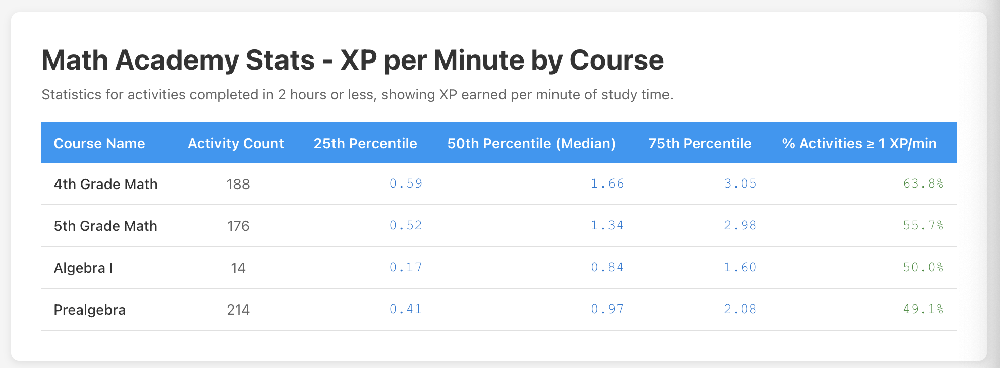

# Math Academy Stats Extension

A browser extension for Chrome and Firefox that helps you analyze your Math Academy activity data.



## Features

- **Fetch Activity Data**: Download all your completed Math Academy activities with automatic pagination and deduplication
- **Export to JSON**: Save all your activity data in JSON format
- **Export to CSV**: Export activity data to CSV with key fields for analysis in spreadsheets
- **Generate Statistics**: View detailed XP per minute statistics by course, including percentiles and performance metrics

## Installation

### For Chrome

1. Clone this repository
2. Install dependencies:
   ```bash
   pnpm install
   ```
3. Build the extension:
   ```bash
   pnpm run build
   ```
4. Open Chrome and navigate to `chrome://extensions/`
5. Enable "Developer mode" in the top right
6. Click "Load unpacked" and select the `.output/chrome-mv3` directory

### For Firefox

1. Follow steps 1-2 above
2. Build the Firefox version:
   ```bash
   pnpm run build:firefox
   ```
3. Open Firefox and navigate to `about:debugging#/runtime/this-firefox`
4. Click "Load Temporary Add-on"
5. Navigate to `.output/firefox-mv2` and select the `manifest.json` file

## Development

Start the development server:

```bash
# For Chrome
pnpm run dev

# For Firefox
pnpm run dev:firefox
```

## Usage

1. Make sure you're logged into Math Academy (https://www.mathacademy.com)
2. Click the extension icon to open the popup
3. Click "Get Activity Data" to fetch all your activities (this may take a few moments)
4. Once data is loaded, you can:
   - **Download JSON**: Get all your activity data in JSON format
   - **Download CSV**: Export data to CSV with these fields:
     - id, type, points, pointsAwarded
     - topic.id, topic.name, topic.course.id, topic.course.name
     - started, completed
     - test.id, test.name, test.course.id, test.course.name
   - **Generate Stats**: Opens a new tab with detailed statistics

## Statistics

The "Generate Stats" feature provides:

- **Filtering**: Only includes activities completed within 2 hours of starting
- **XP per Minute**: Calculates efficiency by dividing points awarded by duration
- **Percentiles**: Shows 25th, 50th (median), and 75th percentiles for each course
- **Performance Metrics**: Percentage of activities achieving at least 1 XP per minute
- **Course Breakdown**: Separate statistics for each Math Academy course you've studied

## Technical Details

Built with:
- [WXT](https://wxt.dev) - Browser extension framework
- React + TypeScript
- Manifest V3 (Chrome) and V2 (Firefox)

## Permissions

The extension requires:
- `storage`: To temporarily store statistics between popup and stats page
- `tabs`: To open the statistics page in a new tab
- `https://www.mathacademy.com/*`: To fetch your activity data from the Math Academy API

## License

This is a personal project for analyzing Math Academy data.
