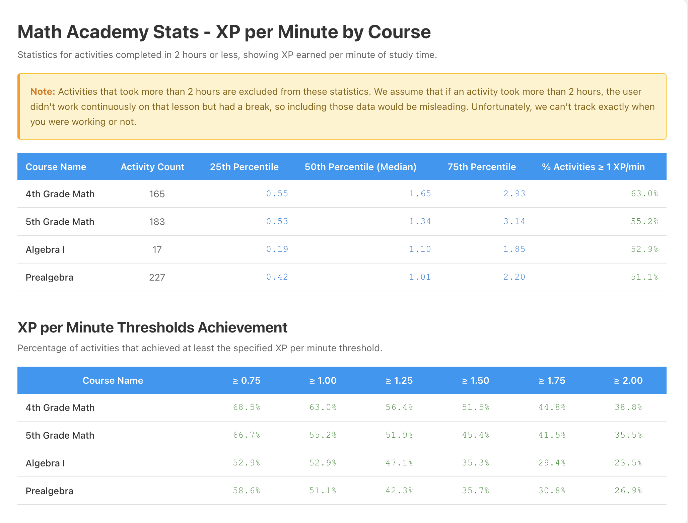

# Math Academy Stats Extension

A browser extension for Chrome and Firefox that helps you analyze your Math Academy activity data.



## Features

- **Fetch Activity Data**: Download all your completed Math Academy activities with automatic pagination and deduplication
- **Export to JSON**: Save all your activity data in JSON format
- **Export to CSV**: Export activity data to CSV with key fields for analysis in spreadsheets
- **Generate Statistics**: View detailed XP per minute statistics by course, including percentiles and performance metrics

## Installation

### 🚀 Quick Install (Recommended)

**For most users, install from the latest release:**

1. Go to the [Releases page](https://github.com/rahimnathwani/mathacademy-stats/releases)
2. Download the zip file for your browser:
   - **Chrome**: Download `chrome-mv3.zip`
   - **Firefox**: Download `firefox-mv2.zip`
3. Extract the zip file to a folder on your computer
4. Follow the browser-specific installation steps below

#### Chrome Installation
1. Open Chrome and navigate to `chrome://extensions/`
2. Enable "Developer mode" in the top right
3. Click "Load unpacked" and select the extracted `chrome-mv3` folder

#### Firefox Installation
1. Open Firefox and navigate to `about:debugging#/runtime/this-firefox`
2. Click "Load Temporary Add-on"
3. Navigate to the extracted `firefox-mv2` folder and select the `manifest.json` file

### 🔧 Build from Source (For Developers)

**Only use this if you want to modify the extension or contribute to development:**

1. Clone this repository:
   ```bash
   git clone https://github.com/rahimnathwani/mathacademy-stats.git
   cd mathacademy-stats
   ```

2. Install dependencies:
   ```bash
   pnpm install
   ```

3. Build the extension:
   ```bash
   # For Chrome
   pnpm run build
   
   # For Firefox
   pnpm run build:firefox
   ```

4. Follow the browser-specific installation steps above, but use the `.output/chrome-mv3` or `.output/firefox-mv2` directories instead

## Development

**This section is only for developers who want to modify the extension.**

### Development Commands

Start the development server with hot reload:

```bash
# For Chrome
pnpm run dev

# For Firefox
pnpm run dev:firefox
```

### Available Scripts

- `pnpm run dev` - Start Chrome development server with hot reload
- `pnpm run dev:firefox` - Start Firefox development server with hot reload
- `pnpm run build` - Build Chrome extension for production
- `pnpm run build:firefox` - Build Firefox extension for production
- `pnpm run zip` - Create zip file for Chrome extension
- `pnpm run zip:firefox` - Create zip file for Firefox extension

## Usage

1. Make sure you're logged into Math Academy (https://mathacademy.com or https://www.mathacademy.com)
2. Click the extension icon to open the popup
3. Click "Get Activity Data" to fetch all your activities (this may take a few moments - the extension automatically detects which hostname you're using)
4. Once data is loaded, you can:
   - **Download JSON**: Get all your activity data in JSON format
   - **Download CSV**: Export data to CSV with these fields:
     - id, type, points, pointsAwarded
     - topic.id, topic.name, topic.course.id, topic.course.name
     - started, completed
     - test.id, test.name, test.course.id, test.course.name
   - **Generate Stats**: Opens a new tab with detailed statistics

## Statistics

The "Generate Stats" feature provides:

- **Filtering**: Only includes activities completed within 2 hours of starting
- **XP per Minute**: Calculates efficiency by dividing points awarded by duration
- **Percentiles**: Shows 25th, 50th (median), and 75th percentiles for each course
- **Performance Metrics**: Percentage of activities achieving at least 1 XP per minute
- **Course Breakdown**: Separate statistics for each Math Academy course you've studied

## Technical Details

Built with:
- [WXT](https://wxt.dev) - Browser extension framework
- React + TypeScript
- Manifest V3 (Chrome) and V2 (Firefox)

## Permissions

The extension requires:
- `storage`: To temporarily store statistics between popup and stats page
- `tabs`: To open the statistics page in a new tab and detect the current Math Academy hostname
- `https://mathacademy.com/*` and `https://www.mathacademy.com/*`: To fetch your activity data from the Math Academy API (automatically detects which hostname you're using)

## License

This is a personal project for analyzing Math Academy data.
